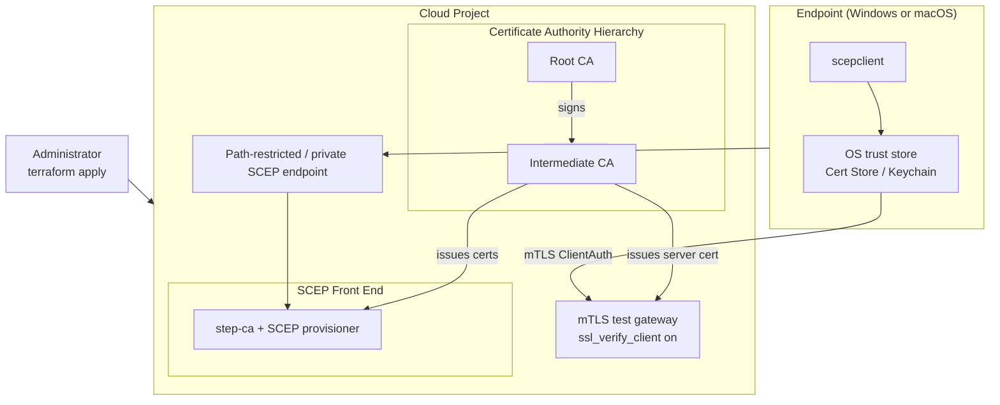

# Device Trust PKI Infrastructure

This repository is a Terraform project that automates a certificate based
device trust build: a CA hierarchy you control, a SCEP endpoint for
enrollment, install scripts that put the resulting certificate into the
OS's own trust store on Windows and macOS, and a small mTLS gateway that
proves the certificate actually works for TLS ClientAuth, not just that it
was issued.

The design, the reasoning behind it, and a full walkthrough are covered in
[Automating Device Trust: A Terraform Blueprint for step-ca and Google Cloud CAS](https://hackersvanguard.com/automating-device-trust-a-terraform-blueprint-for-step-ca-and-google-cloud-cas/).
That post also links back to the two posts this project builds on: why
[certificate based device trust](https://hackersvanguard.com/certificate-based-device/)
matters in the first place, and the original manual
[step-ca and Google Cloud CAS](https://hackersvanguard.com/device-trust-with-step-ca-and-google-cloud-cas/)
build this Terraform project automates.

## Architecture Overview



Today's implementation is Google Cloud: Google Cloud Private CA (CAS) for
the root and intermediate CA, step-ca running on a Compute Engine VM as a
CloudCAS Registration Authority with a SCEP provisioner, a path-restricted
HTTPS load balancer as the public SCEP endpoint, and a small nginx VM as the
mTLS test gateway. Full module-by-module detail, security considerations,
known limitations, and troubleshooting for this implementation live in
[docs/gcp-details.md](docs/gcp-details.md).

AWS support also exists (`aws/`, a separate Terraform root with its own
state): AWS Private CA for the root and intermediate CA, and AWS Private
CA's fully managed Connector for SCEP as the SCEP front end - no step-ca VM
required on this side. The infrastructure has been deployed and
enrollment-verified end to end against a real AWS account: the CA
hierarchy issues valid certificates, the SCEP connector serves `GetCACert`
correctly, a real device enrolls successfully through the install scripts,
and the issued certificate works for TLS ClientAuth against the mTLS test
gateway. Getting enrollment working required patching around two issues in
the `micromdm/scep` client the install scripts use - see
[docs/aws-details.md](docs/aws-details.md) for the full deployment guide,
what differs from the GCP design, and the "SCEP Client Compatibility"
section for what those issues were and how they're handled.

## Features

- A CA hierarchy you control, root and intermediate, rather than a
  third-party managed PKI
- SCEP enrollment for ordinary endpoints and MDM agents, no proprietary
  client required
- A minimal public surface: only the SCEP operation is reachable, not the
  CA's or RA's full API
- Install scripts that install the enrolled certificate into the OS's own
  trust store (Windows certificate store, macOS login keychain) so browsers
  and other TLS ClientAuth consumers pick it up natively
- A built-in mTLS test gateway to verify enrollment produced something
  actually usable, not just a file on disk

## Prerequisites

- Terraform >= 1.0
- An authenticated CLI session for your target cloud (today: `gcloud`,
  authenticated against a Google Cloud project with billing enabled)
- See [docs/gcp-details.md](docs/gcp-details.md) for the full, provider
  specific prerequisite list

## Quick Start

```bash
terraform init
terraform plan -var="project_id=<your-project-id>"
terraform apply -var="project_id=<your-project-id>"
```

Or set `project_id` (and anything else you want to override) in a
`terraform.tfvars` file instead of passing `-var` every time. See
`variables.tf` for the full list of configurable inputs and their defaults.

After `apply`, pull the values you need for enrollment:

```bash
terraform output -raw scep_endpoint_url          # https://<gateway-ip>/scep/device-trust-scep
terraform output -raw scep_challenge_password     # SCEP shared secret
terraform output -raw root_ca_certificate > root-ca.crt
terraform output -raw mtls_gateway_url            # optional, for the mTLS test
```

Verify the SCEP endpoint is actually serving before touching an endpoint:

```bash
curl -sk -o getcacert.der -w "HTTP_STATUS=%{http_code}\n" \
  "$(terraform output -raw scep_endpoint_url)?operation=GetCACert"
openssl pkcs7 -inform DER -in getcacert.der -print_certs -noout
```

A `200` and a printed certificate chain means the CA hierarchy, the SCEP
front end, and the gateway in front of it are all wired together correctly.

## Certificate Enrollment

`install-windows.ps1` / `install-windows.bat` / `install-macos.sh` download
`micromdm/scep`'s `scepclient`, install the root CA into the OS trust store,
and request a device certificate over SCEP. They take the SCEP server URL,
provisioner name, challenge, and root CA (as a URL or a local file) as
environment variables or (PowerShell only) named parameters - see
`config.sh` for the full variable list and where each value comes from.

**These scripts should be treated as a best-effort starting point, not a
fully tested, hardened deliverable.** `install-windows.ps1` and
`install-windows.bat` have each been run end-to-end against a real
deployment (cert issuance, cert-store install, and the mTLS gateway test all
verified live); `install-macos.sh` has had several rounds of real-machine
fixes and has also been run end-to-end successfully. Deep troubleshooting
and the debugging history behind both scripts' non-obvious choices are in
[docs/gcp-details.md](docs/gcp-details.md#enrollment-deep-dive).

**The root CA file/URL is not optional.** `scepclient` verifies the SCEP
server's own TLS certificate before it will enroll at all, and each script's
first real step is installing that same root CA into the OS trust store -
without it, enrollment fails at the very first request. Always pass it,
either as a local file (`root-ca.crt`, exported above) or a URL if you're
hosting the PEM somewhere.

**`install-windows.ps1` and `install-macos.sh` derive the intermediate CA
automatically** from the SCEP server's own `GetCACert` response, so it
doesn't need to be distributed separately. Only fall back to
`terraform output -raw intermediate_ca_certificate > intermediate-ca.crt`
plus `-IntermediateCaFile`/`INTERMEDIATE_CA_FILE_SRC` if you're pointing a
script at a SCEP server that doesn't return the same thing (not implemented
for `install-windows.bat`, which always requires it explicitly if you want
the full chain bundled).

### Windows (PowerShell)

Run elevated. Note `-RootCaFile` is bound to env var `ROOT_CA_FILE`, not
`ROOT_CA_FILE_SRC`:

```powershell
.\install-windows.ps1 `
  -ScepServerUrl "https://$(terraform output -raw scep_gateway_ip)" `
  -Provisioner "device-trust-scep" `
  -Challenge "$(terraform output -raw scep_challenge_password)" `
  -RootCaFile ".\root-ca.crt" `
  -MtlsGatewayUrl "$(terraform output -raw mtls_gateway_url)" `
  -KeyProtection "Delete"
```

`-KeyProtection` (`Delete` default, or `RestrictPermissions`) controls
whether the loose private key file is deleted after import (matches
"non-exportable" most literally, but forces a full re-enrollment on every
renewal) or kept with a locked-down ACL (cheaper renewals, weaker
guarantee). See [docs/gcp-details.md](docs/gcp-details.md#windows-the--keyprotection-trade-off-in-full)
for the full trade-off, including the certificate-issuance cost angle.

### Windows (Batch)

Run from an elevated `cmd.exe`; env var only, no named parameters, and uses
`ROOT_CA_FILE_SRC` (like macOS) rather than `ROOT_CA_FILE`:

```bat
set SCEP_SERVER_URL=https://<scep-gateway-ip>
set SCEP_PROVISIONER=device-trust-scep
set SCEP_CHALLENGE=<scep-challenge-password>
set ROOT_CA_FILE_SRC=.\root-ca.crt
set MTLS_GATEWAY_URL=<mtls-gateway-url>
set KEY_PROTECTION=Delete
install-windows.bat
```

### macOS

```bash
export SCEP_SERVER_URL="https://$(terraform output -raw scep_gateway_ip)"
export SCEP_PROVISIONER="device-trust-scep"
export SCEP_CHALLENGE="$(terraform output -raw scep_challenge_password)"
export ROOT_CA_FILE_SRC="./root-ca.crt"
export MTLS_GATEWAY_URL="$(terraform output -raw mtls_gateway_url)"  # optional
chmod +x install-macos.sh
sudo -E ./install-macos.sh
```

`sudo -E`, not plain `sudo`, is required - plain `sudo` resets the
environment and silently drops every exported variable. The certificate and
its private key land in **your own login keychain** (not the System
keychain, not loose files), which is what Safari/Chrome consult for a TLS
ClientAuth challenge. Expect an interactive password/Touch ID prompt; that
is macOS enforcing authentication on keychain writes, not a bug. On a
renewal, the previous device certificate is automatically removed from the
keychain. Full detail on all of this, including a cosmetic "ghosted
certificate" quirk you may see afterward, is in
[docs/gcp-details.md](docs/gcp-details.md#macos-the-keychain-cleanup-story).

### Verifying enrollment against the mTLS test gateway

```bash
# No client cert -> rejected
curl -k https://<mtls-gateway-url>/            # 400 No required SSL certificate was sent

# Valid client cert -> accepted
curl -k --cert client.crt --key client.key https://<mtls-gateway-url>/
# mTLS authentication successful.
# Verify: SUCCESS
# Client DN: CN=...
```

All three install scripts run this exact check automatically after
installing the certificate and print `PASS`/`FAIL`, so you know immediately
whether enrollment produced a certificate that is actually usable for
ClientAuth.

### Manually, with scepclient directly

```
SCEP Server: https://<scep-gateway-ip>/scep/device-trust-scep
Challenge:   terraform output -raw scep_challenge_password
CA cert:     terraform output -raw root_ca_certificate
```

## Cleanup

```bash
terraform destroy
```

The CA hierarchy has deletion protection enabled by default and requires a
deliberate extra step before `destroy` will succeed - see
[docs/gcp-details.md](docs/gcp-details.md#cleanup) for the exact steps and
the reasoning behind them before you run this against anything you care
about.

## Documentation

- [docs/gcp-details.md](docs/gcp-details.md) - Google Cloud architecture
  detail, security considerations, known limitations, troubleshooting, and
  cleanup
- [docs/aws-details.md](docs/aws-details.md) - AWS design options
  (planned, not yet implemented)

## Support

- [Google Cloud Private CA Documentation](https://cloud.google.com/private-ca/docs/overview)
- [step-ca Documentation](https://smallstep.com/docs/step-ca/)
- [step-ca Registration Authority mode](https://smallstep.com/docs/step-ca/registration-authority-ca/)

## License

This configuration is provided as-is for educational and commercial use.